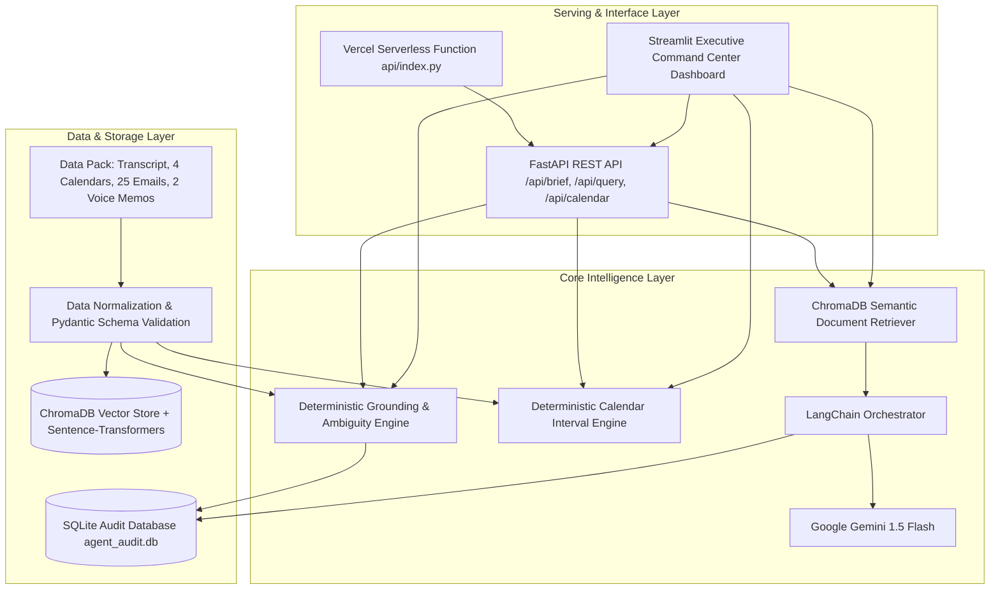
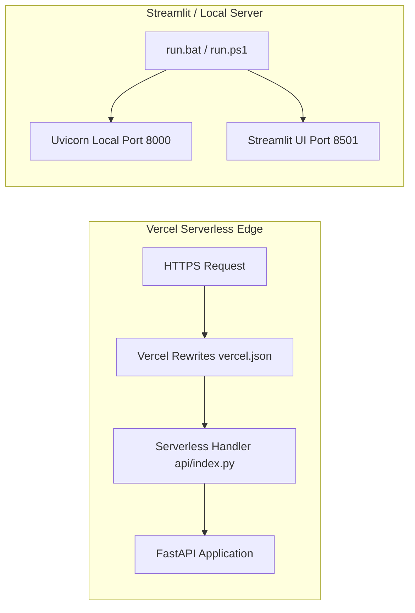

# System Architecture: Executive Productivity Agent

**Project:** AIONOS Batch 2027 — Assignment 1  
**Candidate:** Aniruddh Mishra (Bennett University)  
**Target Executive:** Arjun Malhotra, VP Sales (Veridian Corp)  
**Evaluation Scenario:** 21–25 September 2026  

---

## 1. High-Level Architectural Overview

The Executive Productivity Agent is built on a **Hybrid Deterministic + Retrieval-Augmented Generation (RAG)** architecture. It solves the critical enterprise challenge of context fragmentation and deadline drift while strictly preventing hallucinations on legally binding or high-stakes corporate commitments.



---

## 2. Component Breakdown

### 2.1 Ingestion & Normalization Layer (`app/config.py`, `data/source_data.json`)
- **Granular Document Chunking:**
  - Meeting dialogue turns extracted with speaker attribution and meeting context.
  - Emails decomposed into individual sender/recipient/timestamp messages under subject threads.
  - Personal voice memos attributed directly to Arjun's internal commitments.
  - Calendars mapped into structured datetime intervals.
- **Pydantic Validation (`app/models.py`):** Ensures all inputs and API outputs conform to strict typing schemas.

### 2.2 Semantic Vector Search (`app/rag.py`)
- **Vector Database:** `ChromaDB` running in persistent mode (`data/chroma`).
- **Embedding Model:** `sentence-transformers/all-MiniLM-L6-v2` (384-dimensional dense embeddings).
- **Retrieval Strategy:** Top-$k$ similarity search with cosine distance metric, combined with source metadata filtering (speaker, date, medium).

### 2.3 Deterministic Grounding & Guardrails (`app/core.py`)
To prevent LLM hallucinations on enterprise compliance and legally binding deadlines, the agent uses a **deterministic precedence rule layer**:
1. **Mumbai Office Lease Renewal:**
   - *Issue:* Facilities sent two signature reminders due Friday 25 Sep EOD. Divya speculated Facilities might own it in the sync.
   - *Arjun's Directive:* *"flag it, don't assume"*.
   - *Corroborating Evidence:* Raghav confirmed on Thursday 4:45 PM that it remains unowned. Arjun noted in his voice note that someone must own it and it is not him.
   - *Guardrail Decision:* **Ownership is strictly reported as UNASSIGNED / CRITICAL BLOCKER**. The system actively blocks any assumption of Facilities ownership.
2. **Vendor List Commitment:**
   - *Issue:* Arjun promised Raghav the list by Tuesday EOD, then delayed to Wednesday morning. Raghav checked in at 8:45 AM Wednesday.
   - *Guardrail Decision:* **Status is reported as AT RISK / OPEN (Overdue)** until explicit confirmation of sending is found.
3. **July Expense Variance Report:**
   - *Issue:* Divya promised for Wednesday evening; delivered at 6:00 PM; acknowledged by Arjun at 6:10 PM.
   - *Guardrail Decision:* **Status is COMPLETED**.
4. **Meridian Logistics Reschedule:**
   - *Issue:* Rescheduled to Wednesday 3:00 PM; reconfirmed by Priya at 1:30 PM and Arjun at 2:00 PM.
   - *Guardrail Decision:* **Status is CONFIRMED**.
5. **Q3 Campaign Deck Review:**
   - *Issue:* Moved from Wednesday to Thursday 9:30 AM before Arjun's Board Prep block; Neha delivered draft at 8:00 AM Thursday.
   - *Guardrail Decision:* **Status is SCHEDULED**.

### 2.4 Deterministic Calendar Intelligence Engine (`app/calendar_engine.py`)
- Standard executive hours configured from 09:00 to 18:00.
- Calculates interval differences between scheduled events and blocked focus periods:
$$\text{Free Intervals} = [09:00, 18:00] \setminus \bigcup (\text{Event Start}_i, \text{Event End}_i)$$
- Subdivides continuous free intervals into discrete meeting slots of requested duration (e.g., 15, 30, or 60 minutes).
- Supports multi-attendee schedule intersection to identify mutually open windows across Arjun, Neha, Raghav, and Divya.

### 2.5 LangChain + Google Gemini Layer (`app/core.py`)
- Used for open-ended executive queries that benefit from conversational reasoning.
- **Model:** Google Gemini 1.5 Flash (`temperature=0.0`).
- **Prompt Engineering:** Strict system instructions enforcing citation grounded exclusively in the retrieved evidence chunks.

### 2.6 Persistence & Governance (`data/agent_audit.db`)
- SQLite database logging every executive interaction:
  - `id`: Auto-incrementing query index.
  - `query`: The user's input prompt.
  - `answer`: The generated response.
  - `model_used`: Engine used (`LangChain + Gemini 1.5 Flash` or `Deterministic Grounding Engine`).
  - `created_at`: Exact timestamp.

---

## 3. Deployment Topologies



### Vercel Serverless Configuration
- Configured via `vercel.json`:
  ```json
  {
    "version": 2,
    "builds": [{"src": "api/index.py", "use": "@vercel/python"}],
    "routes": [{"src": "/(.*)", "dest": "api/index.py"}]
  }
  ```
- Lightweight entrypoint `api/index.py` dynamically resolves Python pathing for serverless runtime.

---

## 4. Security & Compliance Safeguards
1. **No Outbound Mutation without Confirmation:** The agent reports statuses and drafts recommendations, but never automatically mutates calendars or dispatches external emails without human confirmation.
2. **Environment Variable Hygiene:** All sensitive API keys (`GEMINI_API_KEY`, `GOOGLE_API_KEY`) are managed strictly via `.env` and `.env.example`.
3. **Complete Audit Trail:** Every transaction is permanently captured in SQLite for regulatory review and post-incident auditing.
