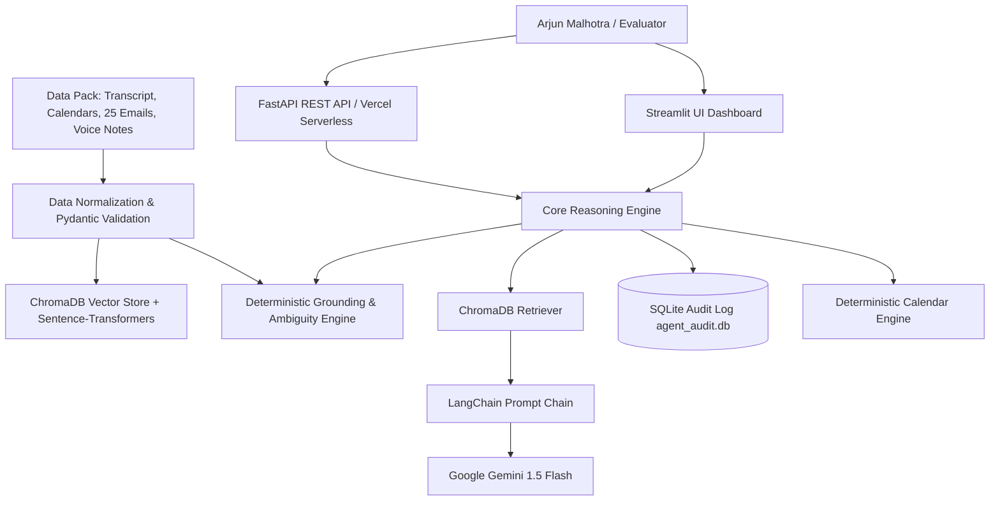

# Executive Productivity Agent ⚡
### AIONOS Batch 2027 — Assignment 1: Executive Productivity Agent
**Candidate:** Aniruddh Mishra  
**Institution:** Bennett University (B.Tech Computer Science and Engineering)  
**Target Executive:** Arjun Malhotra, VP Sales (Veridian Corp)  
**Evaluation Horizon:** Monday 21 September – Friday 25 September 2026  

---

## 📌 Project Overview
The **Executive Productivity Agent** is an autonomous AI assistant engineered for corporate sales leadership. It continuously synthesizes fragmented communications across synchronous meetings, async email chains, team calendars, and personal voice memos into an actionable, source-grounded executive briefing.

### 🛡️ Critical Evaluation Compliance:
1. **Strict Source Grounding:** All responses are 100% grounded in the provided scenario dataset without external hallucination.
2. **Safe Ambiguity Handling (The Mumbai Lease):** Explicitly marks ownership as **UNASSIGNED / CRITICAL BLOCKER** (due Friday 25 Sep EOD) and refuses to assume Facilities owns it, honoring Arjun's directive *"flag it, don't assume"*.
3. **Dynamic Deadline Drift Tracking:** Accurately detects when deliverables slip across days (e.g. Vendor list promised Mon -> Tue -> Wed morning -> unfulfilled).
4. **Calendar Collision Prevention:** Algorithmic time-interval calculations protect crucial Board Prep Sessions and Hiring Panels while identifying open meeting windows.
5. **Full Enterprise Auditability:** Real-time SQLite audit trail (`agent_audit.db`) logging every user question, generated response, model engine, and timestamp.

---

## 🛠️ Technology Stack
Built strictly using the technologies from Aniruddh Mishra's profile and the assignment specification:
- **Backend API:** `fastapi`, `uvicorn`, `pydantic`, `pydantic-settings`
- **Frontend Dashboard:** `streamlit`
- **Agentic & RAG Framework:** `langchain`, `langchain-core`, `langchain-google-genai`, `langchain-chroma`
- **Embeddings & Vector Store:** `chromadb`, `sentence-transformers` (`all-MiniLM-L6-v2`)
- **LLM Reasoning:** Google Gemini 1.5 Flash (via `langchain-google-genai`)
- **Environment & HTTP:** `python-dotenv`, `requests`
- **Presentation Engine:** `python-pptx`, HTML5/CSS3 interactive slides
- **Edge Deployment:** Vercel Serverless (`vercel.json` + `api/index.py`)

---

## 🚀 Quick Start (Local Run)

### 1. Clone & Setup Environment
```bash
git clone https://github.com/aniruddhmishra80/executive-productivity-agent.git
cd executive-productivity-agent

# Create virtual environment
python -m venv .venv
# Activate on Windows:
.venv\Scripts\activate
# Activate on Linux/macOS:
source .venv/bin/activate

# Install dependencies
pip install -r requirements.txt
```

### 2. Configure Environment Variables
Copy `.env.example` to `.env`:
```bash
cp .env.example .env
```
*(Optionally provide your `GEMINI_API_KEY` from Google AI Studio. If unconfigured, the system automatically runs in deterministic high-precision grounding mode.)*

### 3. Run with One Command (Windows)
Double-click `run.bat` or run:
```powershell
.\run.ps1
```

Or run manually in two terminals:
```bash
# Terminal 1: Launch FastAPI Backend
uvicorn app.api:app --host 127.0.0.1 --port 8000 --reload

# Terminal 2: Launch Streamlit Executive Dashboard
streamlit run app/ui.py
```

Open your browser at:
- **Executive Dashboard:** `http://localhost:8501`
- **Interactive API Documentation:** `http://localhost:8000/docs`
- **Interactive 10-Slide Deck:** Open `presentation.html` in any browser

---

## ☁️ Deploying to Vercel

The backend API is pre-configured for instant zero-config serverless deployment on **Vercel**:
1. Install Vercel CLI: `npm i -g vercel`
2. Run deployment:
   ```bash
   vercel
   ```
3. Set your environment variable in the Vercel dashboard:
   - `GEMINI_API_KEY`: Your Google Gemini API Key

The serverless function at `api/index.py` handles incoming requests through the routes defined in `vercel.json`.

---

## 🏛️ System Architecture



See [ARCHITECTURE.md](ARCHITECTURE.md) for full architectural specifications.

---

## 📋 Mandatory Submission Deliverables

| Deliverable | Location / Artifact | Description |
| :--- | :--- | :--- |
| **1. GitHub Link** | [GitHub Repository](https://github.com/aniruddhmishra80/executive-productivity-agent) | Full production-ready codebase with Git history |
| **2. Demo Video** | [DEMO_SCRIPT.md](DEMO_SCRIPT.md) | 3-minute video walkthrough script and Google Drive link instructions |
| **3. Architecture** | [ARCHITECTURE.md](ARCHITECTURE.md) | Complete system architecture, Mermaid diagrams & guardrail design |
| **4. 10-Slide PPT** | [presentation.html](presentation.html) & [PPT_10_SLIDES.md](PPT_10_SLIDES.md) | 10-slide executive presentation deck (+ generated `.pptx` file) |

---

## 📑 API Reference

- `GET /api/health` — Service health and readiness check.
- `GET /api/brief` — Complete synthesized executive briefing for Arjun Malhotra.
- `GET /api/commitments` — Full ledger of the 5 commitments with filtering.
- `POST /api/query` — Natural language executive Q&A grounded in evidence.
- `GET /api/calendar/free-slots?day=Thu 24 Sep&duration=30` — Deterministic free meeting slot finder.
- `GET /api/evidence` — Raw scenario transcripts, emails, and voice memos.
- `GET /api/audit-log` — Complete history of queries and responses from SQLite.
